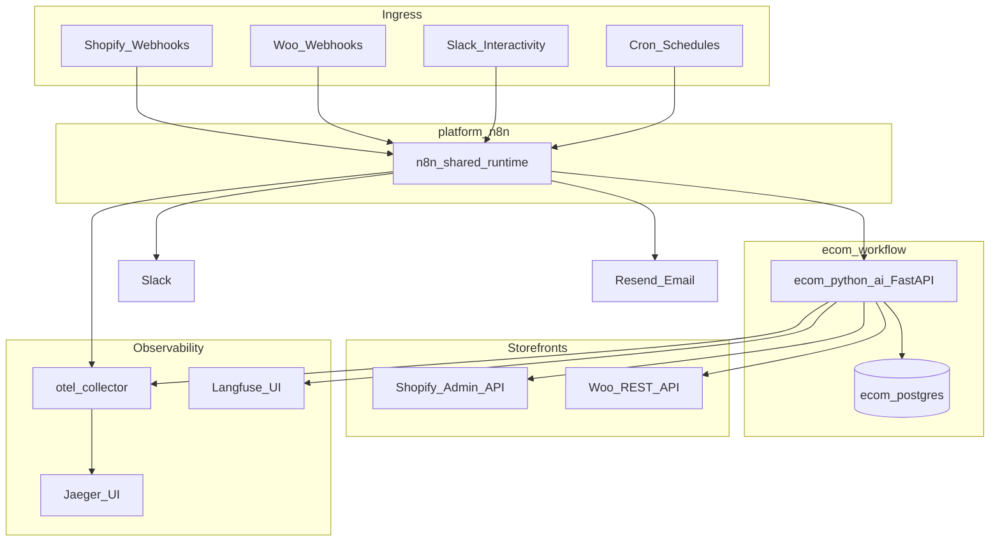

# Architecture

Multi-store e-commerce ops on shared n8n + dedicated FastAPI sidecar + Postgres SoT. P3 adds Woo ingest, live inventory/price writeback (P3b), and ops digests.

## System diagram

## Components

| Component | Role |
|-----------|------|
| **platform-n8n** | Shared n8n runtime; hosts all 13 Ecom workflows |
| **ecom_python_ai** | FastAPI sidecar: ingest, sync, pricing, insights, marketing, ops |
| **ecom_postgres** | Business SoT: products, inventory, orders, returns, config_* |
| **Shopify / Woo** | Webhook ingress + P3b live stock/price writeback |
| **Slack** | Drift alerts, pricing Approve/Reject, summaries, keepalive |
| **Resend** | Marketing email (gated) |
| **OTEL → Jaeger** | Traces (`n8n-platform`, `n8n-ecom-ai-service`) |
| **Langfuse** | LLM generations tagged `ecom-workflow` |

## Networks

| Network | Who joins | Purpose |
|---------|-----------|---------|
| `n8n_platform` | n8n, `ecom_python_ai`, `ecom_postgres` | Sidecar at `http://ecom_python_ai:8001/...` |
| `proxy_network` | n8n, sidecar, OTEL, Langfuse, Jaeger | Observability |

Host port **8003 → 8001**.

## Main pipelines

**P1 trust:** Platform Ingest → Inventory Sync → Order Tracker → Returns

**P2 intel:** Competitor Crawl → Pricing Engine → Customer Insights → Marketing Orchestrator → Slack Actions

**P3 ops:** Daily / Weekly Summary, Health Keepalive; Woo ingest; live writeback when creds + `mode=production`

## Multi-channel SoT

- `config_inventory.master_channel` (default `shopify`) is authoritative.
- `slave_channels` (default `woocommerce`) receive drift writeback in production.
- Same `store_key` maps Shopify + Woo rows to one logical store.

## Correlation

Workflows generate `correlation_id` early; sidecar calls use header `X-Correlation-Id`. Join Jaeger ↔ Langfuse ↔ `audit_logs` / `error_logs`.

See [OBSERVABILITY.md](OBSERVABILITY.md), [WORKFLOWS.md](WORKFLOWS.md), [CONFIG_REFERENCE.md](CONFIG_REFERENCE.md).
