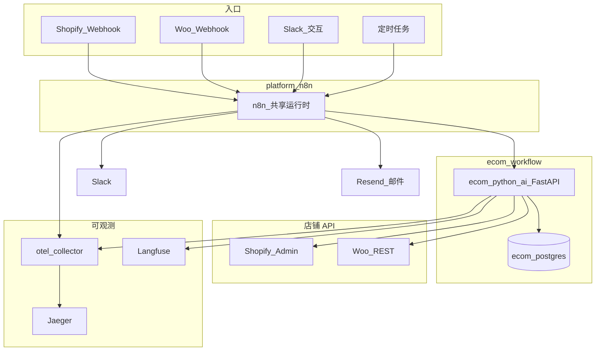

# 架构

多店铺电商运营：共享 n8n + 独立 FastAPI sidecar + Postgres 业务 SoT。P3 增加 Woo 接入、库存/价格 live writeback（P3b）与运维摘要。

## 系统图

## 组件

| 组件 | 职责 |
|------|------|
| **platform-n8n** | 共享 n8n；承载 13 条 Ecom 工作流 |
| **ecom_python_ai** | 接入、同步、定价、洞察、营销、运维 API |
| **ecom_postgres** | 产品/库存/订单/退货/config_* SoT |
| **Shopify / Woo** | Webhook 入站 + P3b 库存/价格回写 |
| **Slack** | 漂移告警、定价审批、摘要、Keepalive |
| **Resend** | 营销邮件（门控） |
| **OTEL → Jaeger** | 链路（`n8n-platform`、`n8n-ecom-ai-service`） |
| **Langfuse** | LLM 追踪，标签 `ecom-workflow` |

## 网络

| 网络 | 成员 | 用途 |
|------|------|------|
| `n8n_platform` | n8n、sidecar、`ecom_postgres` | `http://ecom_python_ai:8001/...` |
| `proxy_network` | n8n、sidecar、OTEL、Langfuse、Jaeger | 可观测出口 |

宿主机 **8003 → 8001**。

## 主链路

**P1 信任路径：** Platform Ingest → Inventory Sync → Order Tracker → Returns

**P2 智能路径：** Competitor Crawl → Pricing Engine → Customer Insights → Marketing Orchestrator → Slack Actions

**P3 运维：** Daily/Weekly Summary、Health Keepalive；Woo 接入；生产模式 + 凭证时 live writeback

## 多渠道 SoT

- `master_channel`（默认 `shopify`）为库存权威。
- `slave_channels`（默认 `woocommerce`）在生产模式下接收漂移回写。
- 同一 `store_key` 将 Shopify 与 Woo 行映射到同一逻辑店铺。

## 关联 ID

工作流早期生成 `correlation_id`；调用 sidecar 时带 `X-Correlation-Id`。可在 Jaeger ↔ Langfuse ↔ `audit_logs` / `error_logs` 间串联。

详见 [OBSERVABILITY.md](OBSERVABILITY.md)、[WORKFLOWS.md](WORKFLOWS.md)、[CONFIG_REFERENCE.md](CONFIG_REFERENCE.md)。
